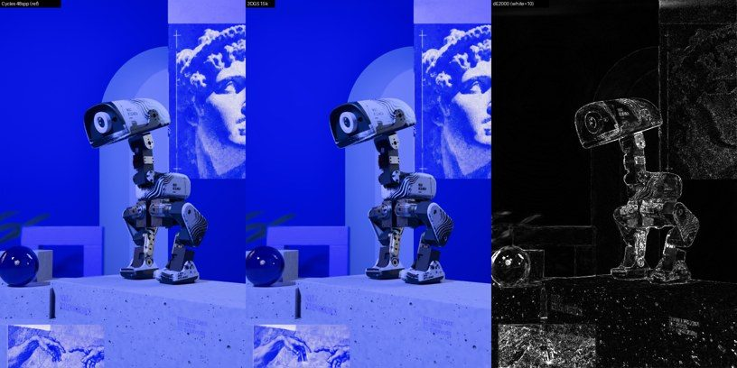
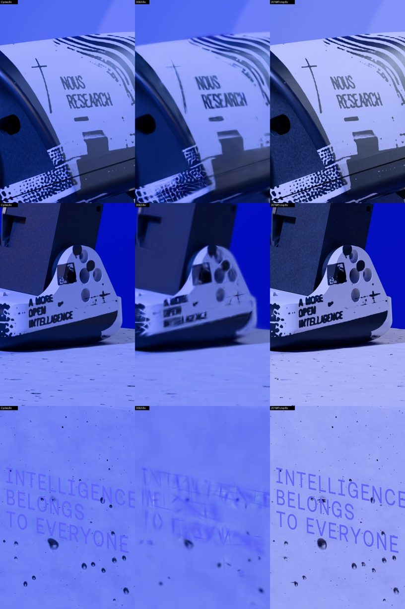
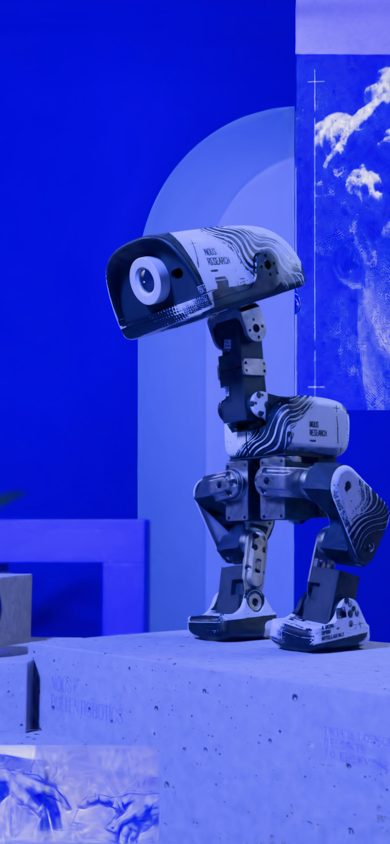

# RFC-005 spike: static 3DGS Blue vs the Cycles / 201MP control

**Status:** RESEARCH SPIKE. No product change. RFC-000 freeze still applies.
**Tracking:** #47 (challenger 1, static 2DGS/3DGS Blue)
**Date:** 2026-09-30. Machine: RTX 3080 Ti 12 GB, Blender 5.2 Cycles/OptiX, nerfstudio splatfacto (gsplat 1.4.0, torch 2.4.1+cu124).
**Raw artifacts:** `/mnt/zer0models/project-artifacts/quackles/process/analysis/rfc-005/`. Scripts are copied to `assets/005-spike/scripts/`.

## Verdict

| Pareto dimension (issue #47 keep gate) | Splat vs control | Call |
|---|---|---|
| Camera freedom: novel views inside the captured dome | 36.6 dB / LPIPS 0.026 on held-out novel views. Real-time. The plate control has no such views at all. | **Wins** (only dimension) |
| Fidelity at the hero view, 1× | 34.0 dB, ΔE₀₀ mean 0.71. Robot regions show ΔE p95 ≈ 5.6, which is visibly softer than Cycles. | Loses |
| Macro / deep zoom (4–8×) | Text and halftone smear into needle artefacts. At 8× the head is 24.0 dB / LPIPS 0.21. The pyramid stays sharp. | **Loses badly** |
| Bytes to first frame (phone) | 5.1 MB `.ksplat` (6.4 MB `.splat` after brotli). The pyramid needs about 0.2–0.8 MB for the first view. | Loses (~6–17×) |
| Mobile viability | Desktop GPU under phone viewport + 4× CPU throttle: p50 7–15 ms/frame. Real phone GPU not measured. | OBSERVE |
| Offline cost | About 2.5 min of dataset render plus 4.6 min of training. The 201MP render took 29 min. | Wins (irrelevant: law 9) |

**Go/no-go:** **NO-GO as a replacement or as a zoom path.** **Conditional GO, research only, for one narrow role:** a free-orbit / novel-view layer at ≤1× magnification, for example a "look around" moment that hands back to the plate or the mesh before any zoom. Even that must still beat RFC-003's mesh + KTX2 for the same orbit, which this spike did not test. The mesh stays scene authority. Nothing here touches #41.

## Method

1. **Dataset.** Built from the saved sha-locked `blue-cinematic.blend` plus `edits/final-blue.json`, with pose p=0 static, following the `recipes.sh blue` recipe. Renders are 544×816 (the hero's 2:3), OptiX-denoised.
   - 113 training views at 32 spp: 91 on a front arc/dome (6 elevation rings from −4° to 66°, r 0.42–0.78 m, lens 26–42 mm), 12 rear/side dome views inside the studio, and 10 close views near the hero line of sight.
   - Held-out views at 48 spp (the shipped setting): the **exact PosterCam hero**, 6 novel between-ring views, and 6 zoom views. The zoom views are exact crops of the hero frame (lens ×N plus sensor shift) at 4× and 8× over the head, foot and plinth text.
   - Cameras are exported as nerfstudio `transforms.json` in Blender world frame (no COLMAP). There are 250k init points sampled from the authored mesh surfaces.
2. **Training.** `ns-train splatfacto`, world frame kept (no auto-orient, centring or scaling), 15k iterations with checkpoints at 7k and 15k. Each iteration took about 15.7 ms, so a full run is about 4.6 min under the GPU lock.
3. **Evaluation.** The model is rendered at the exact plan intrinsics and extrinsics and scored against the Cycles references: PSNR, SSIM, LPIPS-alex, CIEDE2000 (mean / p95 / fraction >5), and ΔE inside 7 hero regions.
4. **Web.** Exported with `ns-export gaussian-splat`, converted to `.splat` (32 B/gaussian, SH0), with `.ksplat` sizes taken from `@mkkellogg/gaussian-splats-3d@0.4.7`'s own compressor. Benchmarked in headless Chromium 151 (ANGLE/Vulkan, hardware GPU confirmed) on a ±20° orbit of 240 frames.

## Numbers

### Held-out views (Cycles 48 spp reference)

| Model | View | PSNR | SSIM | LPIPS | ΔE mean | ΔE p95 | px ΔE>5 | Gaussians |
|---|---|---|---|---|---|---|---|---|
| 7k | hero | 31.99 | 0.957 | 0.043 | 0.93 | 4.23 | 3.9 % | 248k |
| 15k | hero | **34.00** | **0.970** | **0.022** | **0.71** | **3.11** | 2.3 % | 211k |
| 7k | novel ×6 (avg) | 33.93 | 0.966 | 0.039 | 0.64 | 2.48 | — | 248k |
| 15k | novel ×6 (avg) | **36.55** | **0.975** | **0.026** | **0.51** | **1.85** | — | 211k |

Hero region ΔE₀₀ at 15k, as mean / p95:

| Region | ΔE mean | ΔE p95 |
|---|---|---|
| head | 1.46 | 5.60 |
| torso | 1.69 | 5.59 |
| legs | 1.56 | 5.86 |
| orb (glass) | 1.96 | 6.50 |
| plinth | 1.02 | 4.46 |
| print | 0.76 | 2.47 |
| wall | 0.12 | 0.27 |

The error concentrates on robot edges, specular metal and the refractive orb, which are exactly the "HQ robot" pixels that law 8 protects.

### Deep zoom (crop of the hero frame; reference = Cycles at the same crop, which is pyramid-class detail)

| Crop | PSNR | SSIM | LPIPS | ΔE mean | ΔE p95 |
|---|---|---|---|---|---|
| 4× head | 27.74 | 0.932 | 0.090 | 1.46 | 6.76 |
| 8× head | 23.99 | 0.870 | 0.208 | 2.49 | 11.26 |
| 4× foot | 28.59 | 0.922 | 0.182 | 1.23 | 6.28 |
| 8× foot | 25.96 | 0.872 | 0.281 | 1.95 | 9.49 |
| 4× plinth text | 30.49 | 0.917 | 0.310 | 0.96 | 3.44 |
| 8× plinth text | 28.87 | 0.911 | 0.417 | 1.90 | 5.76 |

The splat cannot represent detail finer than its training sampling. "INTELLIGENCE BELONGS TO EVERYONE" becomes unreadable at 8×, halftone dots turn into anisotropic needles, and the foot print turns into rectangles. The 201MP crop (right column) is sharp, although it comes from an older authoring of Blue, so its print and plinth materials differ.

The 4× version is in `assets/005-spike/zoom4-cycles-splat-201mp.jpg`.

### Bytes and runtime

| Asset | Bytes |
|---|---|
| splatfacto ckpt | 153 MB |
| exported `.ply` (SH3) | 50 MB |
| `.splat` 211k (SH0) | 6.76 MB raw / 6.50 gzip / 6.40 brotli (floats barely compress) |
| `.ksplat` (compression level 1) | **5.09 MB**; 100k-gaussian prune: 2.41 MB |
| 201MP pyramid (local `dzi-webp`) | levels 6–3: 0.29 MB; level 2: 0.57 MB; level 1: 2.1 MB; level 0 (lossless): 298 MB, fetched per tile only when zoomed |

Browser frame times, p50 / p95 ms (desktop RTX 3080 Ti; the phone rows emulate viewport and CPU only):

| Profile | 211k | 100k | Load to first frame (211k) |
|---|---|---|---|
| phone 390×844 @3, CPU 4× | 7.4 / 17.8 | 14.6 / 37.7 | 6.9 s |
| phone 390×844 @2, CPU 4× | 11.0 / 30.1 | 12.8 / 27.4 | 9.9 s |
| desktop 1280×800 @1 | 3.1 / 7.1 | 2.9 / 6.2 | 3.5 s |

The GPU queue was shared and contended, so frame times are noisy. That is why 100k is not reliably faster than 211k. Load time is dominated by the 4×-throttled CPU sort/build. **A real phone GPU was not measured (no device):** a 211k-splat, 3-DPR full-screen sort+blend on a mid-range phone is a known risk. Status: OBSERVE.

## Deep-zoom answer

Splats do not zoom: they are band-limited to the training views. Getting pyramid-class 8× detail would need training views at about 8× the sampling over every zoomable surface. That is roughly 64× the pixel supervision, and the gaussian count and bytes grow accordingly. It also gives up the splat's byte advantage to the pyramid, which already stores exactly those pixels for one camera. The supported pattern is a **handoff**: splat or mesh for motion at ≤1×, and the plate or pyramid (or the RFC-003 virtual texture) once magnification exceeds about 1.5×.

## Caveats (honest scope)

- **Resolution.** Training was at 544 px, below the product's plate width (1024+). The 1× hero numbers are at 544. On a 1170 px phone the splat is upscaled, so expect the 1× gap to widen. The next spike is a 1088 px dataset.
- **Novel views.** These interpolate between training rings inside the captured dome. Views outside it (under the plinth, or behind the back wall) are untested and will fail.
- **Static only.** Pose p=0. The robot's jump/explode is not represented. RFC challenger 3 (rigid-part-local splats) is untested.
- **Reference.** The Cycles reference is the recipe scene. The shipped 201MP Blue comes from a different, older authoring, so the zoom comparison against 201MP is visual only.
- **Process.** This was a research spike with no TDD and no blind verifier. Metrics are single-run.

## Next, only if the owner wants to continue after #41

1. Retrain at 1088 px with a 2DGS / mip-splatting variant and re-measure the hero ΔE p95 on the robot.
2. Run a mesh + KTX2 (RFC-003 B1) orbit on the same trace for the actual camera-freedom head-to-head.
3. Measure on a real phone (SPZ or ksplat, ≤100k splats).
